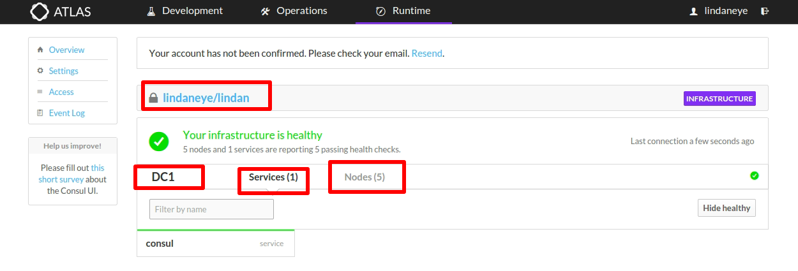

## consul和Atlas的集成，托管consul ui
	
	环境为三台server二台agent

### 1.进入https://atlas.hashicorp.com/account/new

	创建Atlas账号:lindaneye
	

	
### 2.登陆Atlas账号

	
### 3.创建一个box

	创建一个新的box:lindan
	

	
### 4.创建一个Atlas的token

	创建token:xxxxxxxxx
	

	生成token成功如下图所示
	

		
### 5.设置环境变量

### 6.启动consul

### 7.进入Atlas查看

### 8.将第二台server加入集群

### 9.将第三台server加入集群

### 10.将第一台agent加入集群

### 11.将第二台agent加入集群

### 12.执行consul members显示集群成员

### 13.查看集群中成员和服务信息

	

